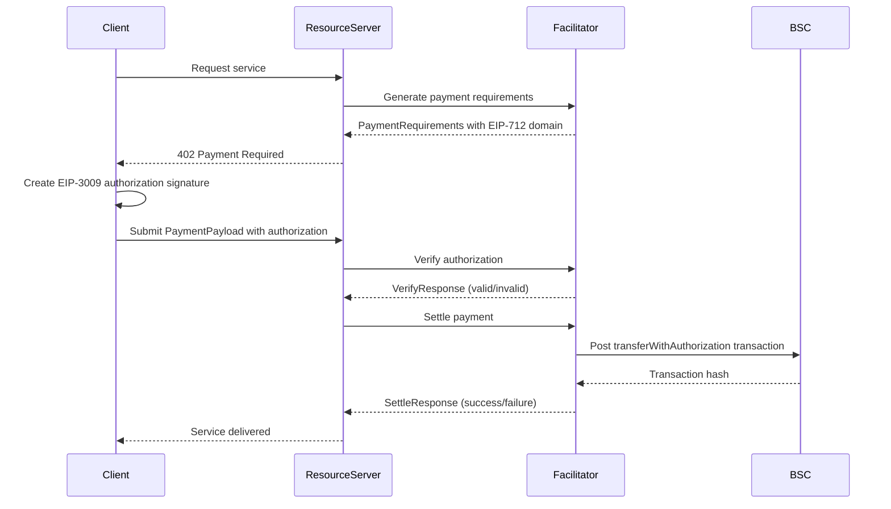

# Exact Payment Scheme for Binance Smart Chain (BSC)

This document specifies the `exact` payment scheme for the x402 protocol on Binance Smart Chain (BSC).

This scheme facilitates payments of a specific amount using ERC-20 tokens (like USDC, USDT) on BSC using EIP-3009 "Transfer With Authorization" standard.

## Scheme Name

`exact`

## Network Identifier

`bsc` - Binance Smart Chain mainnet  
`bsc-testnet` - BSC Testnet

## Key Features

- **EVM Compatible**: Uses standard EIP-3009 for authorization-based transfers
- **Low Fees**: BSC has significantly lower gas fees than Ethereum mainnet
- **Fast Settlement**: ~3 second block times for rapid payment confirmation
- **ERC-20 Support**: Works with any ERC-20 token (USDC, USDT, BUSD, etc.)
- **Secure Authorization**: EIP-3009 provides cryptographic guarantees against replay attacks

## Protocol Flow Overview

The protocol flow for `exact` on BSC follows the standard x402 pattern using EIP-3009 authorization:

1. **Client** makes an HTTP request to a **Resource Server**
2. **Resource Server** responds with `402 Payment Required` containing `paymentRequirements`
3. **Client** creates EIP-3009 signed authorization for the specific payment
4. **Client** sends `PaymentPayload` with signed authorization to Resource Server
5. **Resource Server** calls Facilitator to verify the authorization signature
6. **Resource Server** calls Facilitator to settle payment (facilitator posts on-chain)
7. **Resource Server** grants the **Client** access to the resource

## Sequence Diagram



## `PaymentRequirements` for `exact` on BSC

```json
{
  "scheme": "exact",
  "network": "bsc",
  "maxAmountRequired": "48240000",
  "asset": "0x8AC76a51cc950d9822D68b83fE1Ad97B32Cd580d",
  "payTo": "0xServerWalletAddressHere",
  "resource": "https://api.example.com/ai-service",
  "description": "Batch AI inference request",
  "mimeType": "application/json",
  "maxTimeoutSeconds": 600,
  "extra": {
    "name": "USD Coin",
    "version": 2,
    "chainId": 56,
    "verifyingContract": "0x8AC76a51cc950d9822D68b83fE1Ad97B32Cd580d"
  }
}
```

### Field Descriptions

- `scheme`: Always "exact" for this payment scheme
- `network`: "bsc" for BSC mainnet, "bsc-testnet" for BSC testnet
- `maxAmountRequired`: Payment amount in the token's smallest unit (wei for tokens with 18 decimals)
- `asset`: The ERC-20 token contract address (e.g., USDC on BSC: `0x8AC76a51cc950d9822D68b83fE1Ad97B32Cd580d`)
- `payTo`: Merchant's BSC wallet address to receive payment
- `extra`: EIP-712 domain for signature verification
  - `name`: Token name
  - `version`: EIP-712 domain version
  - `chainId`: BSC chain ID (56 for mainnet, 97 for testnet)
  - `verifyingContract`: Same as `asset` field

## Common BSC Token Addresses

### Mainnet
- **USDC**: `0x8AC76a51cc950d9822D68b83fE1Ad97B32Cd580d`
- **USDT**: `0x55d398326f99059fF775485246999027B3197955`
- **BUSD**: `0xe9e7CEA3DedcA5984780Bafc599bD69ADd087D56`
- **BNB**: Native token, no contract (address `0x0000000000000000000000000000000000000000`)

### Testnet
- **USDC**: `0x0e09fabb73bd3ade0a17ecc321fd13a19e81ce82`
- **USDT**: `0x337610d27c682E347C9cD60BD4b3b107C9d34dDd`

## `PaymentPayload` Structure

The client submits payment authorization using the standard x402 `PaymentPayload` format with EIP-3009 authorization:

```json
{
  "x402Version": 1,
  "scheme": "exact",
  "network": "bsc",
  "payload": {
    "signature": "0x123abc...",
    "authorization": {
      "from": "0xClientAddress",
      "to": "0xServerWalletAddressHere",
      "value": "48240000",
      "validAfter": "0",
      "validBefore": "9999999999",
      "nonce": "0xdef..."
    }
  }
}
```

### Authorization Fields

- `from`: Client's BSC address (payer)
- `to`: Merchant's BSC address (recipient)
- `value`: Payment amount in token's smallest unit
- `validAfter`: Timestamp when authorization becomes valid (usually 0)
- `validBefore`: Timestamp when authorization expires
- `nonce`: Unique identifier to prevent replay attacks
- `signature`: EIP-712 signature of the authorization

## EIP-712 Domain for BSC

The EIP-712 domain structure for BSC tokens:

```typescript
{
  name: "USD Coin",              // Token name
  version: "2",                   // Domain version
  chainId: 56,                   // BSC mainnet (97 for testnet)
  verifyingContract: "0x8AC76a51cc950d9822D68b83fE1Ad97B32Cd580d"  // Token contract
}
```

## Facilitator Responsibilities

The Facilitator handles all BSC-specific operations:

### Payment Verification
- Validate EIP-712 signature format and correctness
- Verify authorization matches payment requirements
- Check client has authority to authorize this payment
- Confirm authorization hasn't expired or been used
- Verify nonce hasn't been consumed (replay protection)
- Return `VerifyResponse` with validation result

### Payment Settlement
- Post `transferWithAuthorization` transaction to BSC
- Transaction uses EIP-3009 authorizations to transfer tokens
- Wait for transaction confirmation on BSC
- Return `SettleResponse` with transaction hash
- Clean up used authorizations and expired nonces

## Security Considerations

**EIP-3009 Security**:
- Signature validation prevents unauthorized payments
- Nonce tracking prevents replay attacks
- Expiration timestamps limit authorization validity window
- Chain ID ensures signatures only valid on BSC

**Resource Server Security**:
- MUST delegate all BSC verification and settlement to facilitator
- MUST NOT implement EIP-712/EIP-3009 logic directly
- MUST follow standard x402 verify/settle pattern
- MUST validate facilitator responses before granting access
- MUST NOT store or handle private keys

**Best Practices**:
- Use HTTPS for all communications
- Validate all facilitator responses
- Implement proper error handling for on-chain failures
- Monitor transaction status before granting access
- Set reasonable authorization expiration windows

## Transaction Structure

The on-chain `transferWithAuthorization` call:

```solidity
function transferWithAuthorization(
    address from,
    address to,
    uint256 value,
    uint256 validAfter,
    uint256 validBefore,
    bytes32 nonce,
    uint8 v,
    bytes32 r,
    bytes32 s
) external
```

## Gas Considerations

- BSC has significantly lower gas prices than Ethereum mainnet
- Typical gas usage: ~80,000-100,000 gas per `transferWithAuthorization` call
- Current (estimate) cost: ~$0.10-0.30 USD per transaction
- Fees paid by facilitator, not client

## References

- [EIP-3009: Transfer With Authorization](https://eips.ethereum.org/EIPS/eip-3009)
- [EIP-712: Ethereum typed data signing](https://eips.ethereum.org/EIPS/eip-712)
- [BSC Official Documentation](https://docs.bnbchain.org/)
- [x402 Core Protocol](https://github.com/coinbase/x402)
- [BSC Token Contracts](https://www.bnbchain.org/en/token)
